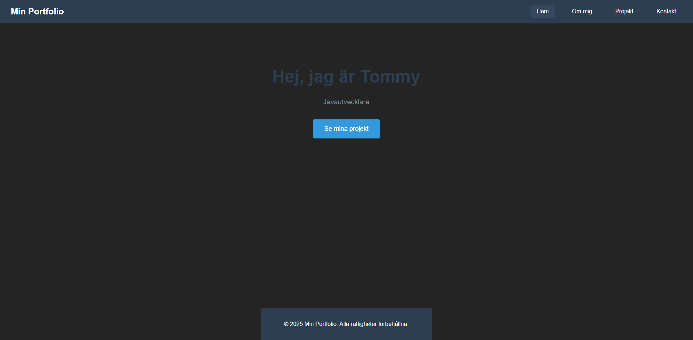
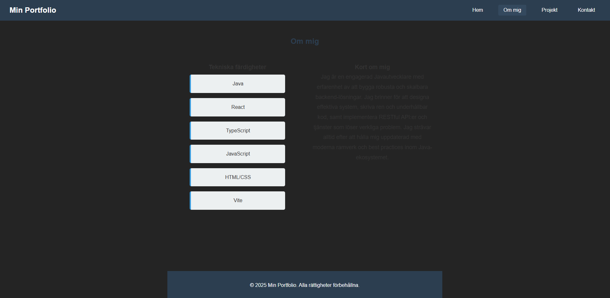
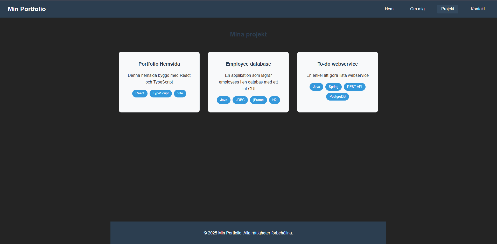
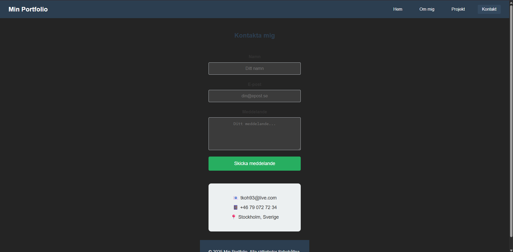
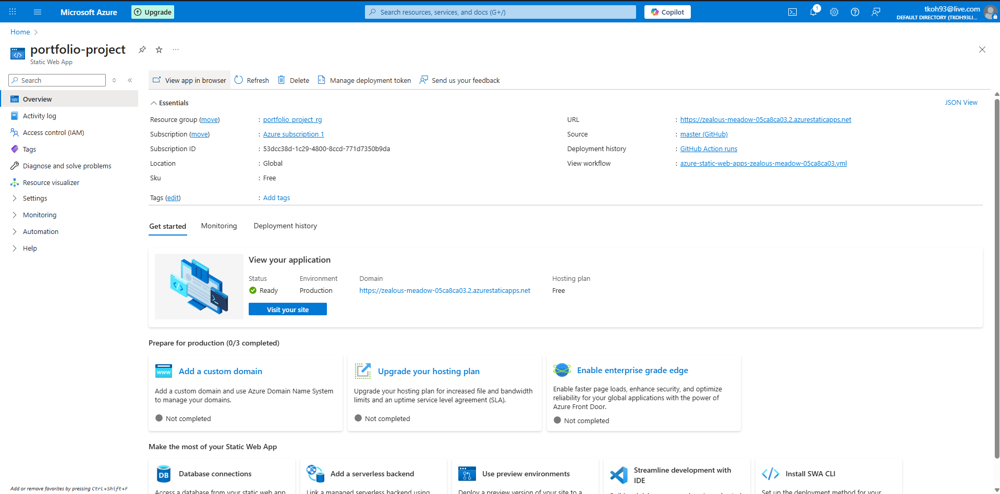
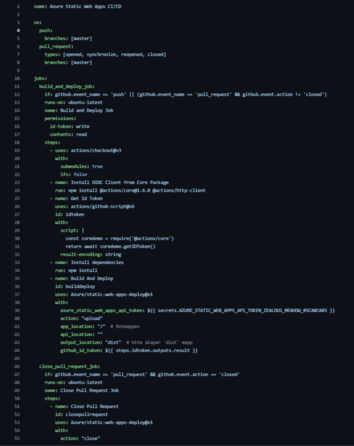

# Min Portfolio

En personlig portfolio-hemsida byggd med **React**, **TypeScript** och **Vite**.  
Syftet är att visa mina tekniska färdigheter, projekt och kontaktinformation på ett enkelt och stilrent sätt.

---

## Teknologier

- React 18 + TypeScript  
- Vite  
- CSS-moduler för styling  
- Formulär för kontakt  
- Responsiv design  

---

## Funktioner

- **Navigeringsbar** för att hoppa mellan sektioner: Hem, Om mig, Projekt, Kontakt  
- **Hem-sektion** med presentation och CTA-knapp  
- **Om mig-sektion** med tekniska färdigheter och kort bio  
- **Projekt-sektion** som listar tidigare projekt med teknologier  
- **Kontakt-sektion** med formulär och kontaktinformation  
- **Footer** med copyright-information  

---

## Skärmdumpar

  
  
  
  


---

## Installation (lokalt)

1. Klona repot:
```bash
git clone https://github.com/ditt-användarnamn/portfolio.git
cd portfolio
```
2. Installera dependencies:
```bash
npm install
```
3. Starta utvecklingsserver:
```bash
npm run dev
```
4.Öppna webbläsaren på:
```bash
http://localhost:5173
```

Filstruktur
src/ – frontend (React-komponenter)

App.tsx – huvudkomponenten med navigation och sektioner

App.css – styling

screenshots/ – bilder för README

Deployment på Azure

Denna portfolio är deployad på Azure Static Web Apps.



Så här fungerar det:
När du pushar till master branch i GitHub, körs en GitHub Actions workflow automatiskt:



Installerar dependencies (npm install)

Bygger projektet (npm run build) → skapar produktionsfiler i dist

Deployar dist till Azure Static Web App

Du behöver alltså inte manuellt köra npm run build för deployment, workflow hanterar det.

Om du vill testa lokalt innan deploy kan du köra:
```bash
npm run build
```
Det skapar en produktionsversion i mappen dist som kan köras på valfri server.

## Live-länk

Se portfolion live här: [Portfolio på Azure](https://zealous-meadow-05ca8ca03.2.azurestaticapps.net/)

